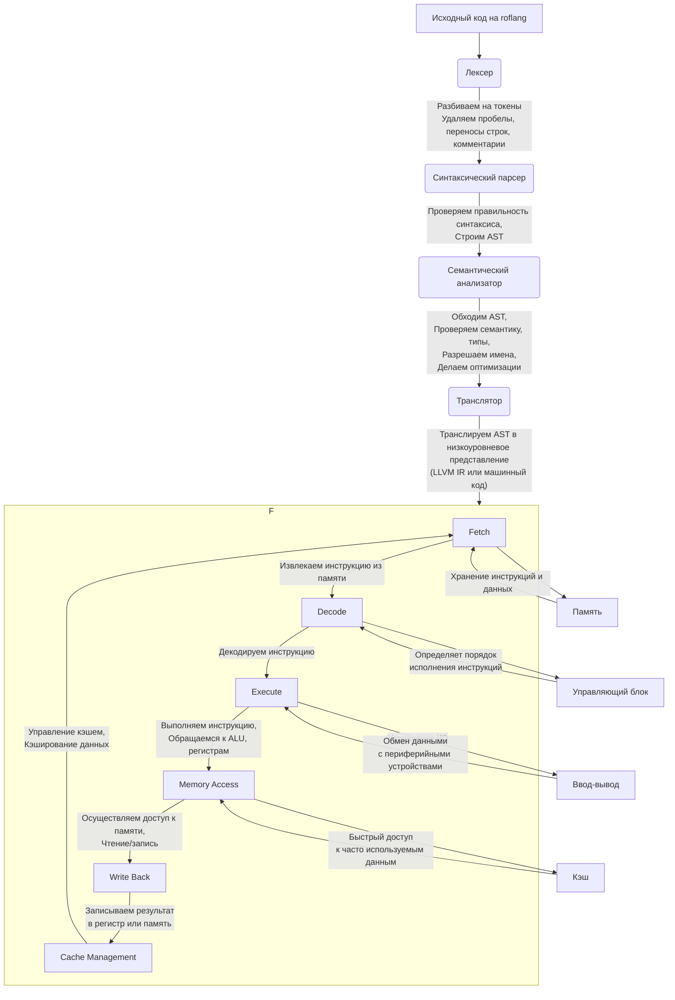

```mermaid
graph TB
    A[Исходный код на roflang] --> B(Лексер)
    B -- "Разбиваем на токены\nУдаляем пробелы, переносы строк, комментарии" --> C(Синтаксический парсер)
    C -- "Проверяем правильность синтаксиса,\nСтроим AST" --> D(Семантический анализатор)
    D -- "Обходим AST,\nПроверяем семантику, типы,\nРазрешаем имена,\nДелаем оптимизации" --> E(Транслятор)
    E -- "Транслируем AST в низкоуровневое представление\n(LLVM IR или машинный код)" --> F[Виртуальная модель процессора]

    subgraph F
        direction LR
        F1[Fetch] -- "Извлекаем инструкцию из памяти" --> F2[Decode]
        F2 -- "Декодируем инструкцию" --> F3[Execute]
        F3 -- "Выполняем инструкцию,\nОбращаемся к ALU, регистрам" --> F4[Memory Access]
        F4 -- "Осуществляем доступ к памяти,\nЧтение/запись" --> F5[Write Back]
        F5 -- "Записываем результат\nв регистр или память" --> F6[Cache Management]
        F6 -- "Управление кэшем,\nКэширование данных" --> F1
    end

    F3 -- "Управление I/O" --> IO[Ввод-вывод]
    IO -- "Обмен данными\nс периферийными устройствами" --> F3

    F4 --> Cache[Кэш]
    Cache -- "Быстрый доступ\nк часто используемым данным" --> F4

    F2 --> ControlUnit[Управляющий блок]
    ControlUnit -- "Определяет порядок\nисполнения инструкций" --> F2

    F1 --> Memory[Память]
    Memory -- "Хранение инструкций и данных" --> F1
```
