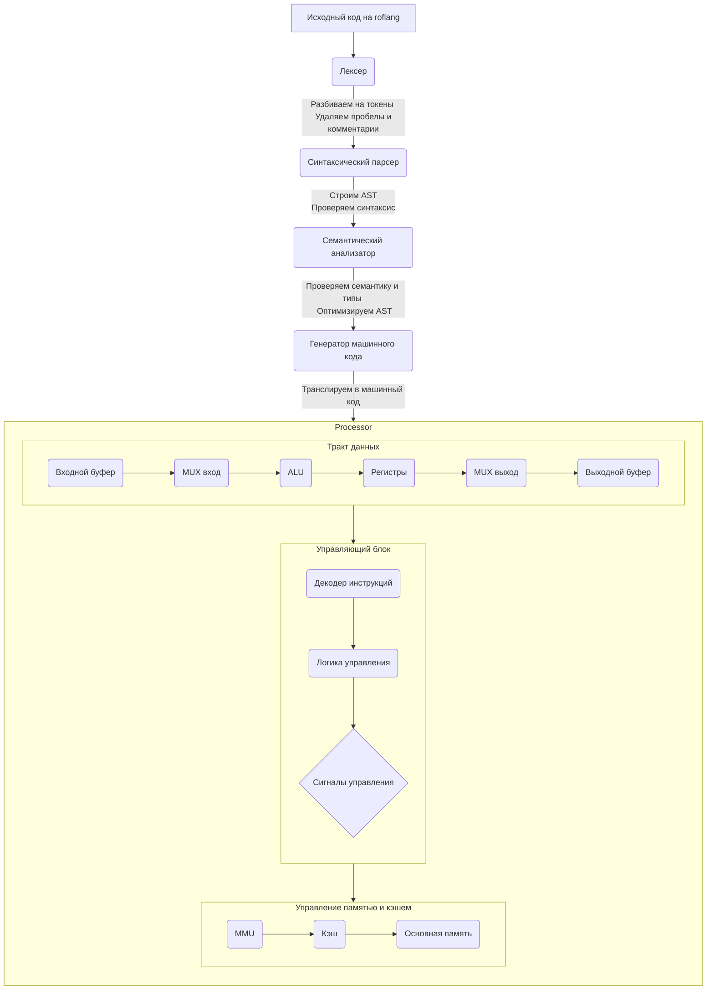

```mermaid
graph TB

A[Исходный код на roflang] --> B(Лексер)
B -- "Разбиваем на токены \n Удаляем пробелы и комментарии" --> C(Синтаксический парсер)
C -- "Строим AST \n Проверяем синтаксис" --> D(Семантический анализатор)
D -- "Проверяем семантику и типы \n Оптимизируем AST" --> E(Генератор машинного кода)
E -- "Транслируем в машинный код" --> Processor[Виртуальная модель процессора]

subgraph Processor
    direction TB

    subgraph DataPath[Тракт данных]
        direction LR
        InputBuffer(Входной буфер) --> MUX1(MUX вход)
        MUX1 --> ALU(ALU)
        ALU --> Registers(Регистры)
        Registers --> MUX2(MUX выход)
        MUX2 --> OutputBuffer(Выходной буфер)
    end

    subgraph ControlUnit[Управляющий блок]
        direction TB
        InstructionDecoder("Декодер инструкций") --> CU("Логика управления")
        CU --> Signals{"Сигналы управления"}
    end

    subgraph MemoryManagement[Управление памятью и кэшем]
        direction LR
        MMU("MMU") --> Cache("Кэш")
        Cache --> MainMemory("Основная память")
    end

    DataPath --> ControlUnit
    ControlUnit --> MemoryManagement
end


```
