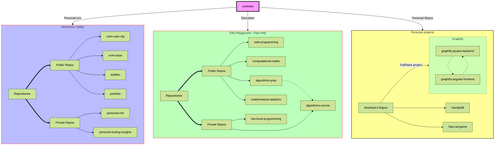

```mermaid
%%{init: {'theme':'forest'}}%%
graph
    A[worthant] -->|Personal env| B[Worthant's Valley]
    A -->|Education| C[Edu Playground - Past Imtjl]
    A -->|Personal Repos| P[Personal projects]
    
    subgraph B[Worthant's Valley]
        RB[Repositories] ==> D
        RB ==> E
        D[Public Repos] --> D1[nvim-user-cfg]
        D --> D2[nvim-base]
        D --> D3[dotfiles]
        D --> D4[portfolio]
        E[Private Repos] --> E1[personal-info]
        E --> E2[personal-tooling-insights]
    end

    subgraph C[Edu Playground - Past Imtjl]
        direction LR
        R[Repositories] ==> F
        R ==> G
        F[Public Repos] --> F1[web-programming]
        F --> F2[computational-maths]
        F --> F3[algorithms-prep]
        F --> F4[mathematical-statistics]
        G[Private Repos] --> G1[low-level-programming]
        G ---> G2[algorithms-course]
    end

    subgraph P[Personal projects]
        direction LR
        H[Worthant's Repos] --> H1[HandyDB]
        H --> H2[http-cat-game]
        H -->|FullStack project| FullStack
        subgraph FullStack[Graphify]
            H3[graphify-javaee-backend]
            H4[graphify-angular-frontend]
            H3 -.-> H4
            H4 -.-> H3
        end
    end
    
    style A fill:#f9f,stroke:#333,stroke-width:4px
    style B fill:#bbf,stroke:#f66,stroke-width:2px,padding:10px
    style C fill:#bfb,stroke:#f66,stroke-width:2px,padding:10px
    style P fill:#ff9,stroke:#333,stroke-width:2px,padding:10px
    
    F3 -.-> G2
```
